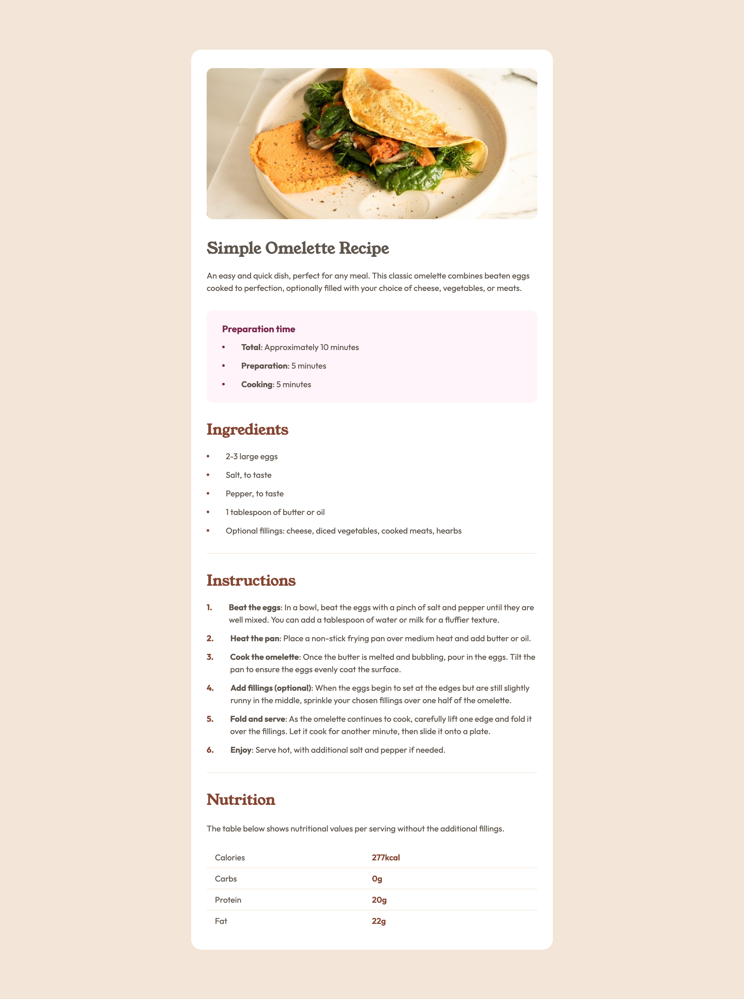

# Frontend Mentor - Recipe page solution

This is a solution to the [Recipe page challenge on Frontend Mentor](https://www.frontendmentor.io/challenges/recipe-page-KiTsR8QQKm). Frontend Mentor challenges help you improve your coding skills by building realistic projects. 

## Table of contents

- [Frontend Mentor - Recipe page solution](#frontend-mentor---recipe-page-solution)
  - [Table of contents](#table-of-contents)
  - [Overview](#overview)
    - [Screenshot](#screenshot)
    - [Links](#links)
  - [My process](#my-process)
    - [Built with](#built-with)
    - [What I learned](#what-i-learned)
  - [Author](#author)

**Note: Delete this note and update the table of contents based on what sections you keep.**

## Overview

### Screenshot



### Links

- Solution URL: [This Repo](https://github.com/zyalwfie/recipe-page)
- Live Site URL: [GitHub Pages](https://zyalwfie.github.io/recipe-page/)

## My process

### Built with

- Semantic HTML5 markup
- Vanilla CSS
- Flexbox
- CSS Grid
- Mobile-first workflow

### What I learned

At first, I had trouble creating a list with small circles on the left. I tried using `<ul>`, but I had trouble spacing the icons and text and aligning them horizontally in the center.

After troubleshooting several times, I tried using flex display for the same layout, but this time the problem was that the icon I used for the small circles shrunk when the text was too long. Finally, I tried using grid display, and it worked to achieve the result I wanted.
```css
.content .second-head .list .list-item {
    display: grid;
    grid-template-columns: min-content 1fr;
    align-items: center;
    column-gap: 2rem;
    line-height: 1.5rem;
}
```

## Author

- Website - [Ziyad Alwafie](https://www.zyalwfie.com)
- Frontend Mentor - [@zyalwfie](https://www.frontendmentor.io/profile/zyalwfie)
- Instagram - [@wwfyy_](https://www.twitter.com/wwfyy_)
